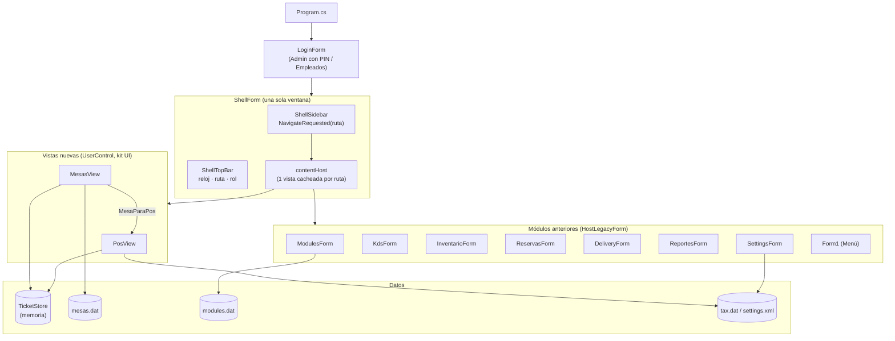
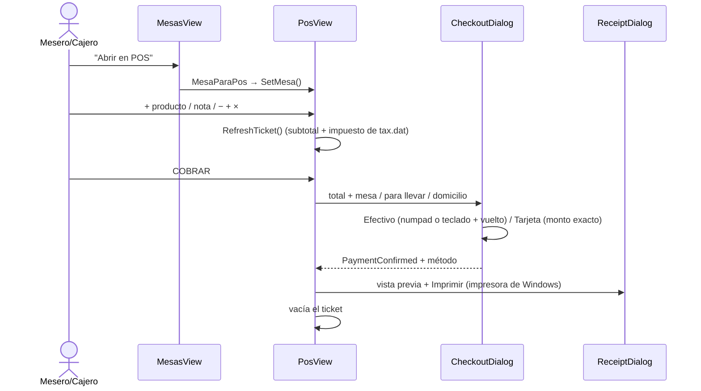

# RestoOS — Gestión de restaurantes (WinForms .NET 8, Windows)

Aplicación de escritorio para Windows para la gestión de restaurantes pequeños e independientes:
**POS + Mesas + Menú + KDS + Inventario + Reservas + Delivery + Reportes**, con módulos que el dueño
activa o desactiva, operación 100 % local y tema oscuro propio.

> **Estado: prototipo de interfaz (solo frontend).** Compila sin errores y la navegación, el cobro y los
> CRUD funcionan en memoria, pero **no hay base de datos**. Solo se guardan en disco algunos archivos
> planos (ver [Persistencia](#persistencia)). Ver también [Limitaciones conocidas](#limitaciones-conocidas).

Especificación de producto: [`requisitos-app-restaurante.md`](requisitos-app-restaurante.md).
Guía del kit visual: [`AppEscritorioWinForms/UI/LEEME_UI.md`](AppEscritorioWinForms/UI/LEEME_UI.md).

---

## Stack técnico

| Capa | Tecnología |
|---|---|
| UI | **Windows Forms sobre .NET 8** (`net8.0-windows`) |
| Lenguaje | C# (code-behind, sin MVVM / sin IoC) |
| Diseño | Todo editable en el **diseñador de Visual Studio** (controles propios en el Cuadro de herramientas) |
| Persistencia | Archivos planos/XML en `%LocalAppData%\RestoOS\` y `data\` |
| Dependencias externas | **0** — sin NuGet, sin red, sin ORM |
| IDE / build | Visual Studio 2022 o superior (workload *Desarrollo de escritorio .NET*), `RestauranteGestor.sln` |
| SO objetivo | Windows 10 (1607+) y Windows 11 — requisito de .NET 8 (ver nota en [Limitaciones](#limitaciones-conocidas)) |

## Estructura del proyecto

```
Desktop/                                   ← raíz del repo (remote: MrDylanDev/Desktop)
├── README.md
├── requisitos-app-restaurante.md          ← spec de producto (§1–§13)
├── RestauranteGestor.sln / .slnx          ← solución (solo el proyecto WinForms)
├── RestauranteGestor.Native/              ← versión WPF .NET 4.8 anterior (referencia visual, fuera de la solución)
└── AppEscritorioWinForms/                 ← app actual: "app escritorio" (WinForms .NET 8)
    ├── Program.cs                         ← Login → ShellForm; "Cambiar perfil" vuelve al login
    ├── Shell/
    │   ├── ShellForm                      ← ventana principal: sidebar + barra superior + contenido
    │   ├── ShellSidebar                   ← menú lateral (Operación / Administración)
    │   └── ShellTopBar                    ← reloj, ruta, rol, "Cambiar perfil"
    ├── UI/                                ← kit visual (RButton, RPanel, RLabel, RTextBox, RComboBox...)
    │   └── LEEME_UI.md                    ← cómo usar el kit y migrar módulos
    ├── Views/
    │   ├── Pos/                           ← POS nuevo: PosView, ProductTile, TicketLineItem, Checkout/Note/Receipt
    │   └── Mesas/                         ← Mesas nuevo: MesasView, TableCard, TableDialog
    ├── Forms/                             ← módulos WinForms anteriores (KDS, Inventario, Reservas, Delivery,
    │                                        Reportes, Configuración, Módulos, Login, PIN admin...)
    ├── Form1.cs                           ← editor de carta ("Menú y productos")
    ├── Controls/                          ← controles del editor de carta y del diseño anterior
    ├── Data/                              ← TicketStore, MesaStore, LocalSettings, MenuStore, OrderHistoryStore
    ├── Models/                            ← MenuItem, Category, OrderRecord
    └── Utils/Theme.cs                     ← paleta y tipografía únicas (copiadas de App.xaml de la versión WPF)
```

---

## Arquitectura



- **Shell + intercambio de `UserControl`** (igual que `MainWindow` en WPF): `ShellForm.Navigate(ruta)` crea cada
  vista una sola vez y la muestra en `contentHost`. Se acabó el "ocultar/mostrar formularios" que parpadeaba.
- **Migración gradual:** los módulos que aún no se rediseñaron se muestran dentro de la ventana principal con
  `HostLegacyForm`, que les oculta su sidebar y topbar viejos.
- **Todo es diseñable:** cada pantalla, tarjeta y diálogo nuevo tiene su `*.Designer.cs` limpio (sin lambdas ni
  código propio), así que se edita desde el diseñador de Visual Studio.

## Kit visual (`AppEscritorioWinForms/UI`)

Réplica en WinForms del tema de `App.xaml` de la versión WPF. Después de compilar, los controles aparecen en el
Cuadro de herramientas y se configuran desde Propiedades → categoría **RestoOS**.

| Control | Equivale en WPF | Propiedades clave |
|---|---|---|
| `RButton` | `PrimaryButton`, `SecondaryButton`, `DangerButton`, `NavButton`, `NumpadButton`, `IconButton` | `Variant`, `Selected`, `Compact` |
| `RPanel` / `RFlowPanel` | `Border` / `Style="Card"` / `WrapPanel` | `Surface`, `CornerRadius`, `BottomBorder` |
| `RLabel` | `TextBlock` | `TextStyle`, `ColorOverride` |
| `RTextBox` | `TextBox` con placeholder | `PlaceholderText`, `Multiline`, `LargeText` |
| `RComboBox` | `ComboBox` oscuro | `Items` |
| `RBadge` | chip (rol, "Operando local") | `Kind` |
| `RCardControl` | base para tarjetas propias | `Surface`, `HoverSurface`, `BorderColor` |
| `RDialogForm` | ventana de diálogo oscura | *Agregar → Formulario heredado* |

Colores y fuentes salen de `Utils/Theme.cs` (Surface `#111415`, Primary `#FFB59D`, Secondary `#FFB95F`,
Tertiary `#4EDEA3`...). Cambiar un color ahí lo cambia en toda la app. Barra de título y scrollbars oscuros en
Windows 10/11.

## Navegación y roles

| Perfil | Acceso |
|---|---|
| **Administrador** (PIN demo `1234`) | **Operación** (POS, Mesas, KDS, Inventario, Reservas, Delivery, Menú) **+ Administración** (Selector de Módulos, Reportes + Trazabilidad, Configuración). Entra a Módulos. |
| **Empleados** | Solo **Operación**. Entra al POS. Reportes y Configuración bloqueados. |

- Atajos: **F1** POS · **F2** Mesas · **F3** Cocina KDS · **ESC** cierra el cobro.
- Los módulos apagados en el *Selector de Módulos* se deshabilitan en el menú al instante (`modules.dat`).
- El menú lateral se ajusta al alto de la pantalla (oculta la tarjeta de sucursal si no cabe) para no mostrar
  barra de desplazamiento.

## Flujo POS → cobro



- Tickets por mesa en `Data/TicketStore` (compartidos entre POS y Mesas; Mesas muestra el total real).
- Notas por ítem ("sin cebolla"), impuesto Exento 0 % / INC 8 % / IVA 19 % (por defecto el de Configuración),
  panel de domicilio propio cuando el módulo Delivery está activo.

## Estado por módulo

| Módulo | Pantalla | Lógica | Persiste |
|---|---|---|---|
| POS | **Nueva** (kit UI) | Ticket por mesa, notas, impuesto, cobro, recibo | No (tickets en memoria) |
| Mesas y Salón | **Nueva** (kit UI) | CRUD, filtro por salón, detalle, abrir en POS | Sí, `mesas.dat` |
| Selector de Módulos | Anterior | Flags reales | Sí, `modules.dat` |
| Menú y productos | Anterior (`Form1`) | CRUD de carta, categorías, fotos, historial | Sí, `data\menu.xml` |
| Configuración | Anterior | Datos del negocio, impuesto por defecto, respaldos | Sí, `settings.xml`, `tax.dat` |
| Cocina KDS | Anterior | Kanban 3 estados (mock) | No |
| Inventario | Anterior | CRUD + alertas de stock | No |
| Reservas | Anterior | Calendario + CRUD | No |
| Delivery | Anterior | Tabla + estados + CRUD | No |
| Reportes | Anterior | KPIs y trazabilidad **mock** | No |
| DIAN / Delivery real | Pendiente (Fase 3) | — | — |

## Persistencia

| Archivo | Ubicación | Qué guarda |
|---|---|---|
| `modules.dat` | `%LocalAppData%\RestoOS\` | Módulos activos (`clave=1/0`) |
| `mesas.dat` | `%LocalAppData%\RestoOS\` | Plano del salón (`Nombre\|Sector\|Capacidad\|Estado\|Total\|CanOpen`) |
| `tax.dat` | `%LocalAppData%\RestoOS\` | Impuesto por defecto (0 / 8 / 19 / 27) |
| `settings.xml` | `%LocalAppData%\RestoOS\` | Nombre, dirección, teléfono, moneda, logo |
| `backups\` | `%LocalAppData%\RestoOS\` | Respaldos manuales desde Configuración |
| `menu.xml`, `orders.xml` | `data\` (relativo a la carpeta de ejecución) | Carta e historial de pedidos del editor de menú |

Tickets del POS, inventario, reservas, delivery y ventas viven en memoria y **se pierden al cerrar**.

## Compilar y ejecutar

Requisitos: Windows 10/11 + Visual Studio 2022 o superior con el workload **Desarrollo de escritorio .NET** (.NET 8 SDK).

1. Abrir `RestauranteGestor.sln` (o `.slnx`) y compilar (**Ctrl+Shift+B**).
2. Ejecutar con **F5**. Perfil `Empleados` (sin PIN) o `Administrador` (PIN demo `1234`).

Por consola:

```powershell
dotnet build "AppEscritorioWinForms\app escritorio.csproj"
dotnet run --project "AppEscritorioWinForms\app escritorio.csproj"
```

> Para editar pantallas: compilar una vez y abrir el `.cs` con doble clic (diseñador). Reglas para no romper el
> diseñador en [`UI/LEEME_UI.md`](AppEscritorioWinForms/UI/LEEME_UI.md).

## Limitaciones conocidas

1. **Sin base de datos** (spec §5 pide SQLite): ventas, tickets, inventario, reservas y delivery no se guardan.
2. **.NET 8 no corre en Windows 8/8.1** (mínimo Windows 10 1607). La spec (§4) pide compatibilidad desde Windows 8;
   la versión WPF anterior (.NET Framework 4.8) sí la cumplía. Decisión pendiente.
3. Los productos del POS están fijos en código; aún no se leen de la carta (`menu.xml`).
4. El editor de carta usa la ruta relativa `data\menu.xml`: depende de la carpeta desde donde se ejecute, y la
   carta de ejemplo trae fotos con rutas de otro equipo.
5. Reportes y KDS muestran datos de demostración (el KDS no recibe comandas del POS).
6. Solo 2 perfiles (spec §3/§6 pide dueño, cajero, mesero, cocina). El PIN de administrador es fijo (`1234`).
7. KDS, Inventario, Reservas, Delivery, Menú, Módulos, Reportes y Configuración aún tienen el diseño anterior
   (se migran uno a uno con el kit, ver `LEEME_UI.md`).
8. Sin tests, sin logging, sin respaldo automático.

## Historial

- **Versión WPF (.NET Framework 4.8)** — `RestauranteGestor.Native/`. Primera interfaz completa con tema oscuro;
  sirve de referencia visual. Ya no forma parte de la solución.
- **Versión WinForms (.NET 8)** — `AppEscritorioWinForms/`. Migración de todos los módulos a WinForms (partiendo del
  editor de carta de David), ventana principal única, kit visual con el mismo look de la versión WPF y pantallas
  editables en el diseñador de Visual Studio.
