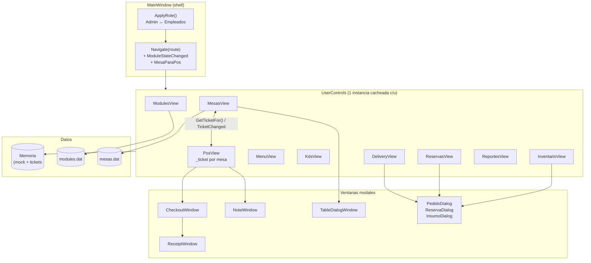
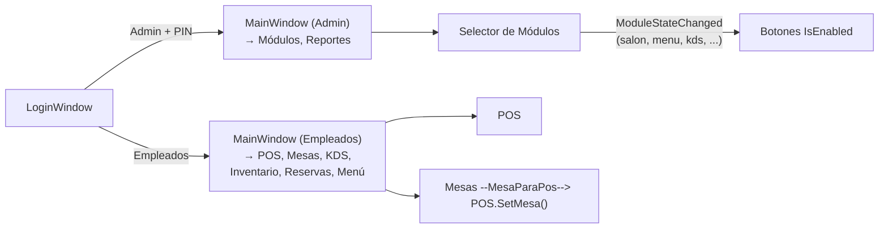
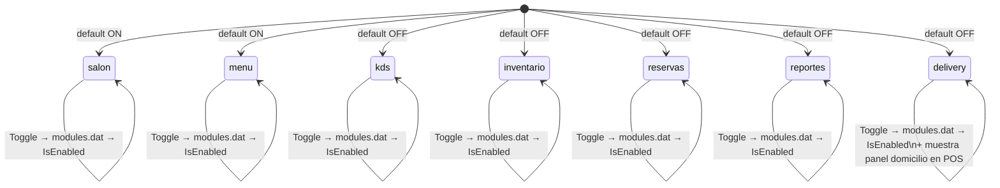
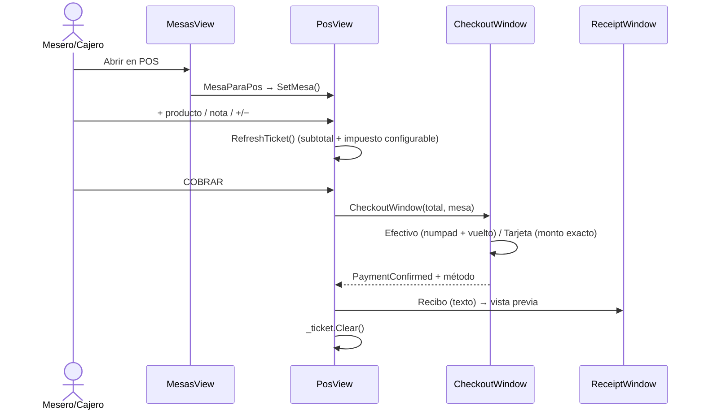
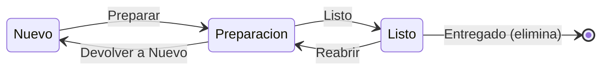
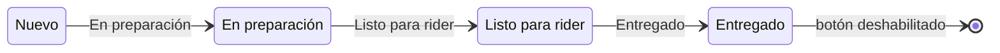

# RestoOS — Gestión de restaurantes (WPF, Windows)

Aplicación de escritorio nativa para Windows para la gestión de restaurantes pequeños e independientes:
**POS + Mesas + Menú + KDS + Inventario + Reservas + Delivery + Reportes**, con arquitectura
modular activable por el dueño, operación 100 % local y tema oscuro propio.

> Estado: **prototipo funcional de UI**. Compila limpio (0 errores), la navegación, el cobro y los
> CRUD en memoria funcionan, pero **no hay base de datos**: solo `modules.dat` y `mesas.dat`
> persisten en disco. Ver [Limitaciones conocidas](#limitaciones-conocidas).

Especificación de producto: [`requisitos-app-restaurante.md`](requisitos-app-restaurante.md).

---

## Stack técnico

| Capa | Tecnología |
|---|---|
| UI | WPF sobre **.NET Framework 4.8** (`LangVersion 7.3`) |
| Lenguaje | C# + XAML (code-behind, sin MVVM / sin IoC) |
| Persistencia | Archivos planos en `%LocalAppData%\RestoOS\` (`modules.dat`, `mesas.dat`) |
| Dependencias externas | **0** — sin NuGet, sin red, sin ORM |
| IDE / build | Visual Studio (MSBuild), `RestauranteGestor.sln` |
| SO objetivo | Windows 8 / 8.1 / 10 / 11 (WPF se eligió justamente por esto; WinUI 3 quedó descartado, ver spec §5) |

## Estructura del proyecto

```
Desktop/                                    ← raíz del repo (remote: MrDylanDev/Desktop)
├── README.md
├── requisitos-app-restaurante.md           ← spec de producto (§1–§13)
├── RestauranteGestor.sln / .slnx
└── RestauranteGestor.Native/               ← único proyecto (WPF, .NET FW 4.8)
    ├── App.xaml / App.xaml.cs              ← tema oscuro global + manejo de errores
    ├── MainWindow.xaml / .xaml.cs          ← shell: sidebar, reloj, navegación, roles
    └── Views/
        ├── LoginWindow                     ← selector de perfil (Admin / Empleados)
        ├── AdminCodeWindow                  ← PIN admin (demo)
        ├── ModulesView                     ← panel de módulos activables
        ├── PosView                         ← punto de venta + ticket
        ├── CheckoutWindow                   ← cobro (efectivo/tarjeta, numpad, vuelto)
        ├── ReceiptWindow                    ← vista previa de recibo
        ├── NoteWindow                       ← notas por ítem ("sin cebolla")
        ├── MesasView + TableDialogWindow    ← plano de salón (único CRUD persistente)
        ├── MenuView                        ← catálogo (solo lectura)
        ├── KdsView                         ← kanban cocina (3 columnas)
        ├── InventarioView                  ← insumos + alertas (CRUD memoria)
        ├── ReservasView                    ← calendario + agenda (CRUD memoria)
        ├── DeliveryView                    ← cola agregador + CRUD memoria + PedidoDialog
        ├── ReportesView                    ← KPIs + trazabilidad (mock)
        └── TrazabilidadView                ← vista sin uso (no instanciada, ver nota)
```

~4.100 líneas en 38 archivos (XAML + C# + spec) + proyecto WinForms de David. Sin tests.

> Menú digital: el apartado `Menú y productos` hospeda el `Form1` de
> `AppEscritorioWinForms` vía `WindowsFormsHost`, con referencia de proyecto
> y semilla de `menu.xml` en `MenuView`. Sin código propio de carta.

---

## Arquitectura



Patrón real: **shell + swap de `UserControl`**. `MainWindow` crea las 9 vistas una vez
(`MainWindow.xaml.cs:12-20`) y las intercambia en `ContentHost`. No hay MVVM, servicios ni
repositorios: cada vista es code-behind con su `ObservableCollection` y sus diálogos.

## Navegación y roles



- `LoginWindow`: dos perfiles. Admin exige PIN (`AdminCodeWindow`, demo `1234`).
- `MainWindow.Navigate()` (`MainWindow.xaml.cs:125-183`) conmuta vistas; `ModuleStateChanged`
  (`:80-117`) habilita/deshabilita botones según `modules.dat`.
- Reportes está bloqueado para Empleados con `MessageBox` (`:162-166`).
- Solo existen **2 roles** (spec §3/§6 pide dueño, cajero, mesero, cocina).

## Sistema de módulos



- Store: `Dictionary<string,bool>` perezoso en `ModulesView.xaml.cs:14-37`, guardado como
  `clave=1/0` (`SaveStore :39-50`).
- El POS lee `delivery=1` directamente del archivo para mostrar el panel de domicilio
  (`PosView.xaml.cs:60,72`) — acoplamiento a archivo que convendría centralizar.
- **No hay plugins/MEF ni carga por DLL** (spec §5): añadir un módulo exige tocar
  `ModulesView` + `MainWindow` y recompilar.

## Flujo POS → cobro



- Productos hardcodeados (`PosView.LoadProducts :100-110`), impuesto seleccionable
  Exento 0 % / INC 8 % / IVA 19 % (`TaxSelector_SelectionChanged :125-133`).
- Ticket por mesa en diccionario estático `_allTickets` (`PosView.xaml.cs:15-21`); evento
  estático `TicketChanged` que refresca Mesas en cada cambio.
- El recibo es **vista previa**: `ReceiptWindow.Print_Click` abre `PrintDialog` pero no imprime
  (falta ESC/POS, spec §8).

## Cocina KDS y Delivery





- KDS: 3 columnas kanban por estación (Parrilla/Fría/Barra), timer 1 s con `Elapsed`
  (`KdsView.xaml.cs:26-28,60-82`). Comandas mock, **no alimentadas por el POS**.
- Delivery: tabla `GridView` (Hora, Plataforma, ID, Cliente, Detalle, Total, Estado,
  Acciones). Botón dinámico por `DataTrigger` sobre `Estado`
  (`DeliveryView.xaml:93-114`); CRUD completo en memoria con `PedidoDialog`
  (`DeliveryView.xaml.cs`, Nuevo pedido / Editar / Eliminar). `Sincronizar` es stub (MessageBox).

## Persistencia

| Archivo (`%LocalAppData%\RestoOS\`) | Formato | Qué guarda |
|---|---|---|
| `modules.dat` | `clave=1/0` por línea | 7 flags: `salon, menu, kds, inventario, reservas, reportes, delivery` |
| `mesas.dat` | `Nombre\|Sector\|Capacidad\|Estado\|Total\|CanOpen` | plano del salón (CRUD completo) |

Todo lo demás (tickets POS, inventario, reservas, delivery, menú, ventas) vive en
`ObservableCollection` en memoria y **se pierde al cerrar**. No hay SQLite (spec §5),
ni backups, ni log transaccional.

## Módulos: qué es real y qué es mock

| Módulo | UI | Lógica | Persiste |
|---|---|---|---|
| Módulos | Sí, toggles | Sí, flags reales | Sí, `modules.dat` |
| POS | Sí, ticket, impuesto, cobro | Sí, cálculo + vuelto | No, tickets en memoria |
| Mesas | Sí, plano + detalle | Sí, CRUD + filtro salón | Sí, `mesas.dat` |
| Menú | Sí, editor de David embebido | Sí, CRUD + fotos + pedidos (WinForms) | Sí, `data\menu.xml` |
| KDS | Sí, kanban 3 estados | Parcial, transiciones mock | No |
| Inventario | Sí, tabla + alertas | Parcial, CRUD sin descuento por venta | No |
| Reservas | Sí, calendario + agenda | Parcial, CRUD con mesas desincronizadas | No |
| Delivery | Sí, tabla + CRUD | Parcial, estados + `PedidoDialog` | No |
| Reportes | Sí, KPIs + gráfico + historial | Mock, datos `Random(42)` | No |
| DIAN / Delivery real | Pendiente, Fase 3 | Pendiente | Pendiente |

## Tema oscuro

`App.xaml` define 8 brushes + estilos globales (`NavButton`, `PrimaryButton`,
`SecondaryButton`, `IconButton`, `DangerButton`, `NumpadButton`, `Card`) y templates propios
para `ComboBox`/`ComboBoxItem`/`TextBox` y **`GridViewColumnHeader`** (los headers heredan el
tema Aero del SO; sin ese override salen en blanco — bug ya corregido una vez en este repo).

## Compilar y ejecutar

Requisitos: Windows + Visual Studio con workload .NET desktop (MSBuild) y .NET Framework 4.8.

```powershell
# 1. Cerrar instancia previa (el .exe se bloquea si sigue corriendo)
Stop-Process -Name RestauranteGestor.Native -Force -ErrorAction SilentlyContinue

# 2. Compilar
& "C:\Program Files\Microsoft Visual Studio\18\Community\MSBuild\Current\Bin\MSBuild.exe" `
    RestauranteGestor.sln /t:Rebuild /v:minimal

# 3. Ejecutar
Start-Process .\RestauranteGestor.Native\bin\Debug\RestauranteGestor.Native.exe
```

Ruta de uso: `Empleados` (sin PIN) → activar módulos en `Selector de Módulos` →
`Delivery`, `Mesas`, `POS`. El perfil `Administrador` pide PIN demo `1234`
(`AdminCodeWindow.xaml.cs:9`).

## Limitaciones conocidas

1. `AdminCodeWindow` tiene PIN demo hardcodeado y fecha de expiración en código.
2. El total del POS se calcula sin redondear pero se muestra redondeado (`C0` es-CO).
3. Ninguna venta se guarda: Reportes/Trazabilidad muestran datos fabricados.
4. `TrazabilidadView` está registrada en el `.csproj` pero **ninguna vista la instancia**;
   `ReportesView` reimplementa su lógica con su propia clase `Venta` duplicada.
5. `KdsView` arranca su `DispatcherTimer` en el constructor y nunca lo detiene.
6. `PosView.TicketChanged` es un evento **estático** con suscripción lambda (fuga + re-render
   de Mesas en cada clic del POS).
7. Semilla de mesas demo en `MesasView.LoadTables` (`MesasView.xaml.cs:58-68`).
8. Atajos anunciados (`F1 POS · ESC`) sin manejadores de teclado.
9. Sin tests, sin logging, sin backup.
